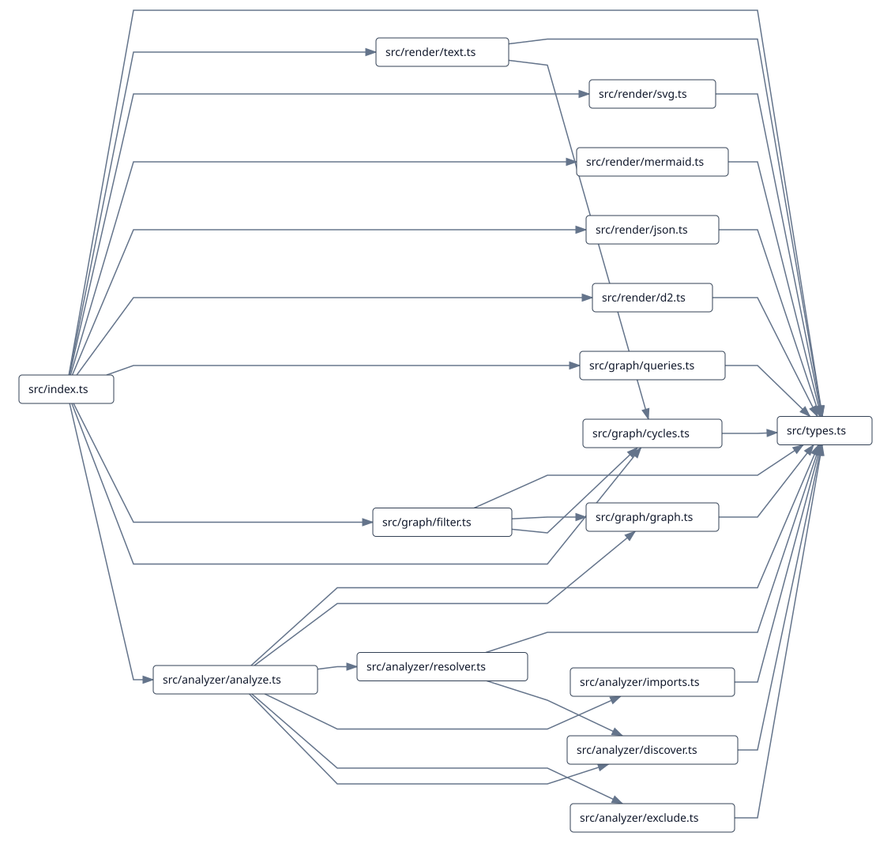

# oxdg

A modern CLI tool for analyzing JavaScript and TypeScript module dependencies, inspired by [Madge](https://github.com/pahen/madge).

oxdg = Oxc Dependency Graph

A modern dependency graph CLI inspired by Madge,
built around the Oxc ecosystem.

Try
```
npx oxdg src/index.ts --image graph.svg
```



## How it compares

oxdg is inspired by [Madge](https://github.com/pahen/madge), but uses a modern
JavaScript/TypeScript stack and provides built-in Mermaid, D2, and standalone SVG
output.

The following is a high-level feature comparison with related tools. It is
directional rather than a benchmark and was checked against the linked public
documentation on 2026-09-22.

| Criterion                     | [Madge](https://github.com/pahen/madge) | [dependency-cruiser](https://github.com/sverweij/dependency-cruiser) | [dpdm](https://github.com/acrazing/dpdm) | [module-graph](https://github.com/thepassle/module-graph) | oxdg |
| ----------------------------- | --------------------------------------- | -------------------------------------------------------------------- | ---------------------------------------- | --------------------------------------------------------- | ------ |
| Active maintenance            | △                                       | ◎                                                                    | ◎                                        | ○                                                         | —      |
| JavaScript / TypeScript       | ○                                       | ◎                                                                    | ◎                                        | ◎                                                         | ◎      |
| ESM                           | ○                                       | ◎                                                                    | ◎                                        | ◎                                                         | ◎      |
| CommonJS                      | ○                                       | ◎                                                                    | ◎                                        | ×                                                         | ◎      |
| Circular dependency detection | ◎                                       | ◎                                                                    | ◎                                        | Not a primary focus                                       | ◎      |
| Mermaid                       | ×                                       | ◎                                                                    | ×                                        | ×                                                         | ◎      |
| D2                            | ×                                       | ◎                                                                    | ×                                        | ×                                                         | ◎      |
| Direct SVG output             | Graphviz                                | Graphviz                                                             | ×                                        | ×                                                         | ◎      |
| SVG without system Graphviz   | ×                                       | ×                                                                    | —                                        | —                                                         | ◎      |
| Lightweight CLI               | ◎                                       | △                                                                    | ◎                                        | Library-oriented                                          | ◎      |

`◎` means a strong fit, `○` supported, `△` partial or requiring more setup,
`×` not documented or not supported, and `—` not rated or not applicable.

- `Graphviz` in the SVG row means the external Graphviz executable is required.
- `—` in the SVG row means the tool does not document SVG output; this row does not judge whether its other reports can run without Graphviz.
- dependency-cruiser's D2 reporter is documented in its [CLI reference](https://github.com/sverweij/dependency-cruiser/blob/main/doc/cli.md#d2).
- `module-graph` refers to `@thepassle/module-graph`; its documented analyzer is ESM-first and does not analyze `require()`.

## One-shot CLI

Generate a standalone SVG without installing Graphviz or any other system package:

```bash
bunx oxdg ./src/index.ts --image graph.svg
```

This writes the generated graph to `graph.svg`, ready to open in a browser or share.

Find circular dependencies in a directory:

```bash
bunx oxdg ./src --circular
```

Example output:

```text
src/a.ts -> src/b.ts -> src/a.ts
```

The same one-shot commands work with `npx`:

```bash
npx oxdg ./src/index.ts --image graph.svg
```

Without an output option, `oxdg` prints a plain-text dependency graph. Other
useful output modes are:

```bash
bunx oxdg ./src --json
bunx oxdg ./src --mermaid
bunx oxdg ./src --d2
```

The CLI needs no configuration file, initialization step, persistent state, or
system Graphviz installation. It resolves modern JavaScript and TypeScript
imports, CommonJS requires, dynamic imports, re-exports, type-only imports,
and TypeScript path aliases.

Additional analysis options are `--cwd`, `--tsconfig`, `--include-npm`, and
`--no-type-imports`. Analysis warnings are written to stderr; structured output
remains on stdout.

## Installation

For repeated use in a project, install `oxdg` with npm or Bun:

```bash
npm install --save-dev oxdg
bun add --dev oxdg
```

The published CLI requires Node.js 22 or newer.

## API

The public API is a small functional layer over the same `ModuleGraph` used by
the CLI:

```ts
import { analyze, findCycles, renderSvg } from "oxdg";

const { graph, warnings } = await analyze("./src");
const cycles = findCycles(graph);
const svg = renderSvg(graph);
```

The API also exposes graph queries and text, JSON, Mermaid, and D2 renderers.
Module IDs are stable paths relative to the analysis root.

## Development

```bash
bun install
bun run check
bun run lint
bun run format:check
bun run build
bun test
bun run release:check
```

`check` runs TypeScript type checking. `build` uses `tsdown` to create a clean
ESM distribution with declarations and source maps. `release:check` packs the
package, checks its contents, installs the packed artifact in a temporary
project, and runs the packaged CLI including version, cycles, JSON, and SVG
checks.
